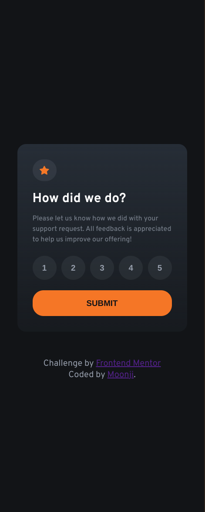

# Frontend Mentor - Interactive rating component solution

This is a solution to the [Interactive rating component challenge on Frontend Mentor](https://www.frontendmentor.io/challenges/interactive-rating-component-koxpeBUmI). Frontend Mentor challenges help you improve your coding skills by building realistic projects. 

## Table of contents

- [Overview](#overview)
  - [The challenge](#the-challenge)
  - [Screenshot](#screenshot)
  - [Links](#links)
- [My process](#my-process)
  - [Built with](#built-with)
  - [What I learned](#what-i-learned)
  - [Continued development](#continued-development)
  - [Useful resources](#useful-resources)
- [Author](#author)

## Overview

### The challenge

Users should be able to:

- View the optimal layout for the app depending on their device's screen size
- See hover states for all interactive elements on the page
- Select and submit a number rating
- See the "Thank you" card state after submitting a rating

### Screenshot
<ins>Frontend Mentor's Desktop Design</ins>:


<ins>My Desktop Solution</ins>:


<ins>Frontend Mentor's Mobile Design</ins>:


<ins>My Mobile Solution</ins>



### Links

- Solution URL: [Github](https://github.com/moonji-spoonji/Interactive-Rating-Component)
- Live Site URL: [Netlify](https://interactive-rating-comp-moonji.netlify.app/)

## My process

### Built with

- Semantic HTML5 markup
- CSS custom properties
- Flexbox
- CSS Grid

### What I learned
#### JS
I learned how to take the inner text of an HTML element and display it in another HTMl element:

```js
const rateButtons = document.querySelectorAll('.selected');

rateButtons.forEach((rating) => {
    rating.addEventListener('click', function() {
        userRating.innerText = rating.innerText;
    });
});
```

### Continued development

In the future I would like to be able to use the value of elements in JS instead of using just the innerText property of an element.

### Useful resources

- [MDN Web Docs](https://developer.mozilla.org/en-US/docs/Web/API/HTMLElement/innerText) - This helped me for take the values of each rating button and use it in the thank you card section.

## Author

- Frontend Mentor - [@moonji-spoonji](https://www.frontendmentor.io/profile/moonji-spoonji)
